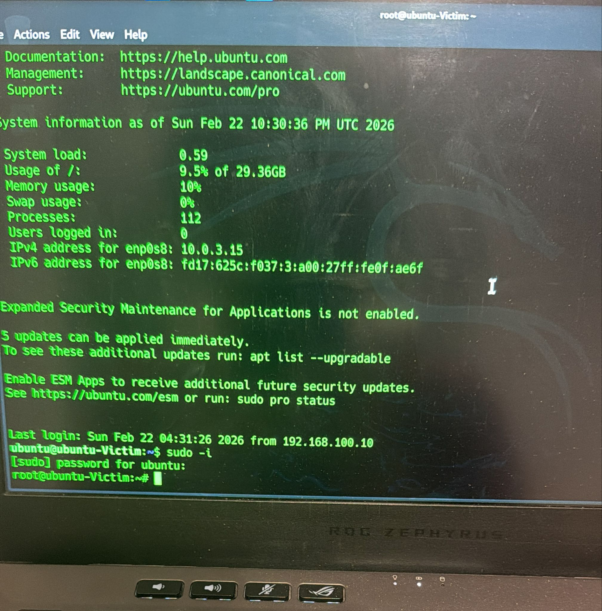

# 1. Attack Simulation – SSH Brute Force

## Objective

To simulate a real-world SSH brute-force attack against a Linux server in a controlled SOC lab environment in order to generate authentic security logs for detection and investigation.

⸻

## Lab Setup

| Role        | Machine            | IP Address      |
|------------|-------------------|-------------------|
| Attacker   | Kali Linux         | 192.168.100.10   |
| Victim     | Ubuntu Server      | 192.168.100.20   |
| SIEM       | Wazuh Manager      | 10.0.0.116       |

⸻

### Reconnaissance

Before launching the attack, SSH service availability was verified:
nmap -p 22 192.168.100.20

Result:
	•	Port 22 open
	•	SSH service accessible

⸻
## Attack Evidence
### Hydra Execution-using my wordlist

### Hydra Execution-using rockyou.txt

Hydra was used to perform a password brute-force attack.
hydra -l fakeuser -P /usr/share/wordlists/rockyou.txt ssh://192.168.100.20 -t 4

Command Breakdown
	•	-l fakeuser → Target username
	•	-P rockyou.txt → Password wordlist
	•	ssh:// → Target service
	•	-t 4 → Number of parallel tasks

Hydra attempted thousands of login combinations against the SSH service.

⸻

### Attack Behavior Observed on Victim

The attack generated:
	•	Multiple “Failed password” logs
	•	Invalid user login attempts
	•	Authentication failure spikes
	•	PAM authentication errors

These logs were written to:
/var/log/auth.log

### Simulated Successful Compromise

To simulate real attacker success, a valid login event was generated:
ssh ubuntu@192.168.100.20
This produced:
	•	“Accepted password” log entries
	•	Session opened messages
	•	Post-authentication activity

⸻

### Post-Authentication Activity (Privilege Escalation Simulation)

After login, sudo activity was triggered:
sudo -i
This generated:
	•	PAM session opened logs
	•	Root privilege escalation logs
	•	Additional authentication traces

⸻

### Purpose of Simulation

The objective was to:
	•	Generate realistic brute-force attack logs
	•	Create failed + successful authentication patterns
	•	Produce escalation artifacts
	•	Feed telemetry into Wazuh for SIEM-based detection
	•	Validate manual detection scripts

⸻

### Why This Matters in SOC

SSH brute-force attacks are common in enterprise environments.

A SOC analyst must be able to:
	•	Identify abnormal authentication spikes
	•	Detect repeated failures from single IP
	•	Correlate successful login after failures
	•	Investigate privilege escalation attempts
	•	Escalate incident if compromise confirmed
## Next 
- [Detection Engineering](./2-detection-engineering)
